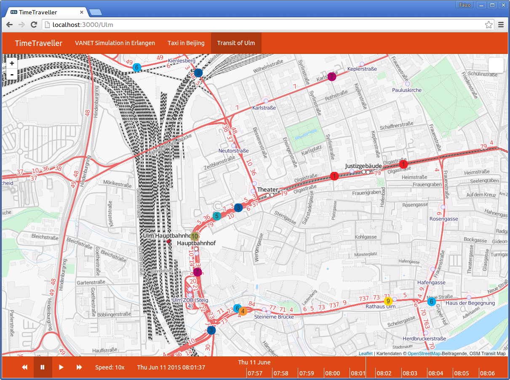

# Timetraveller

[](https://greenkeeper.io/)

Webservice to explore spatio-temporal data in an interactive way.



## Installation

```shell
git clone https://github.com/fnogatz/timetraveller.git
cd timetraveller
npm install
```

## Maps

The available maps are configured by YAML files in the `/maps` directory. Simply copy the provided `example.yml` and change it to fit your needs.

### Creation

Create a new YAML file in the `/maps` directory. The filename will be map's identifier. That means if you save a `my-map.yml`, this map will be accessable as `http://domain.tld/my-map`.

A step-by-step guidance to import and display GTFS transit data can be found in the [wiki](https://github.com/fnogatz/timetraveller/wiki/Example-Setup-for-GTFS).

## Server

You can start the webserver by calling:

```shell
npm start
```

## Model Connectors

This is a list of currently available connectors.

- [timetraveller-mongodb](https://github.com/fnogatz/timetraveller-mongodb): Connector for MongoDB

### Write your own

The timetraveller server can use any data source. A `Connector` object is used to access your data. It only has to provide the following signature:

```javascript
// Constructor
var connector = new Connector(options)

// Method to find trajectories
connector.findTrajectories(query)
/**
 * Search parameters:
 *
 * query.time.start     (Start of time range)
 * query.time.end       (End of time range)
 * query.bounds.east    (Bounding Box)
 * query.bounds.west
 * query.bounds.north
 * query.bounds.south
 */
```

Have a look at [timetraveller-mongodb](https://github.com/fnogatz/timetraveller-mongodb) for a working connector example.

## Background

Timetraveller and its related tools [timetraveller-mongodb](https://github.com/fnogatz/timetraveller-mongodb) (data storage), [zeitpunkt](https://github.com/fnogatz/zeitpunkt) (GeoJSON simplification) and [transportation](https://github.com/fnogatz/transportation) (GTFS parsing) were realized as a project as part of the Masters programme in Computer Science at the University of Ulm, Germany. The project report with additional information about its architecture is available online at https://fnogatz.github.io/paper-now-timetraveller/.
